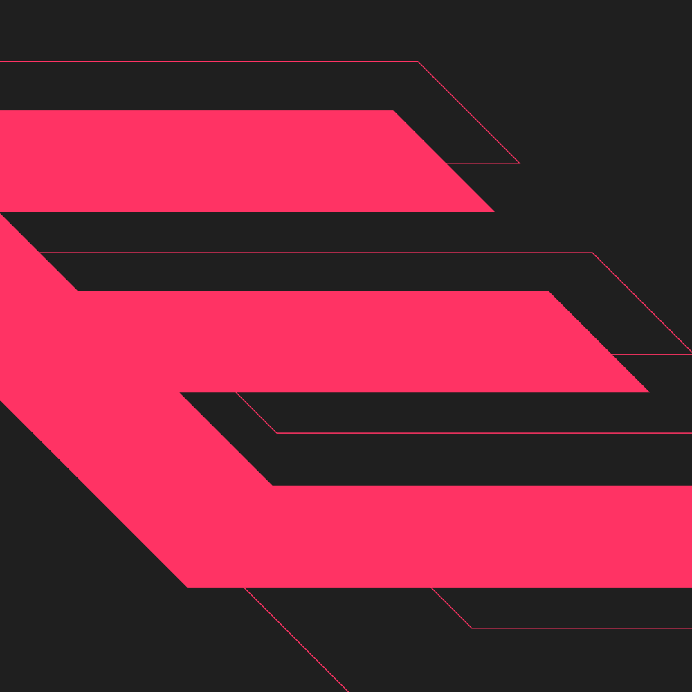

  

  <h3>I am</h3>
  <h4>-> <a href="https://www.python.org">Python</a> Developer <-</h4>
  <h4>-> <a href="https://www.javascript.com">JavaScript</a> Developer <-</h4>
  <h4>-> <a href="https://www.typescriptlang.org">TypeScript</a> Developer <-</h4>
  <h4>-> <a href="https://medium.com/meverse/what-is-blockchain-and-what-is-it-for-761926fdbbea">Blockchain</a> Developer <-</h4>
  <h4>-> <a href="https://www.microsoft.com/en-in/security/business/security-101/what-is-cybersecurity">Cybersecurity</a> Enthusiast <-</h4>

<h4 align="center">Professional Languages and Tools</h4>

  
  
  
  
  
  
  

<h4 align="center">Coming Soon Projects</h4>

  
  
  

<h4 align="center">Follow Me</h4>

  
  
  

  
<b>Discord Presence</b>

  

  
<b>GitHub Stats</b>

  
  

  
<b>Favorite Repositories</b>

  
  

  
  

  

  
<b>WakaTime</b>

  

